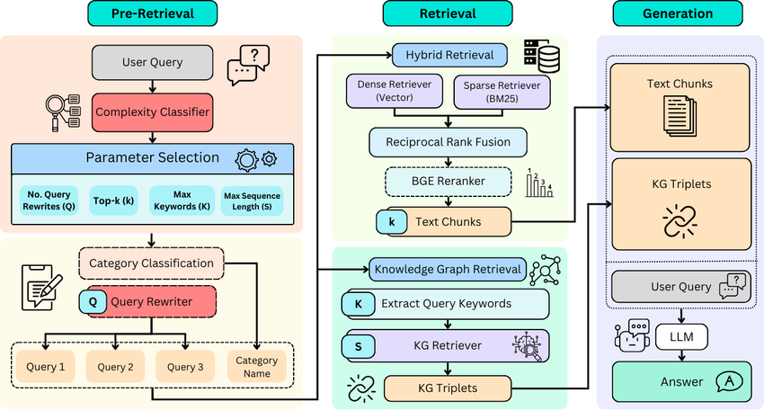

# FoodGuru: Production-Grade RAG System from the Yelp Data

**FoodGuru** is a high-performance Retrieval-Augmented Generation (RAG) system engineered to provide grounded, location-aware restaurant recommendations. It leverages a **Hybrid Search Architecture** (Dense Vectors + Sparse Keywords) fused with a Cross-Encoder Reranker to retrieve precise context from the Yelp Academic Dataset, which is then synthesized by a 4-bit quantized LLM.

The system is architected as a set of decoupled, asynchronous microservices to ensure scalability and fault tolerance.


---

## Technical Architecture

### 1. Hybrid Search Engine (The "Retriever")

The core retrieval logic solves the "vocabulary mismatch problem" inherent in semantic search by combining two distinct indexing strategies.



**Dense Retrieval (Semantic):**
* **Model:** `intfloat/e5-large-v2` (1024 dimensions).
* Captures conceptual similarity (e.g., "cheap eats" → "affordable prices").
* **Index:** HNSW (Hierarchical Navigable Small World) graph in **Qdrant** for sub-millisecond approximate nearest neighbor search.


**Sparse Retrieval (Lexical):**
* BM25 (Best Matching 25).
* Captures exact keyword matches (e.g., specific dish names like "Tonkotsu Ramen" or dietary tags like "Gluten-Free").
* An in-memory inverted index built dynamically on the candidate subset or pre-computed, optimized for high-precision filtering.


**Fusion Strategy: Reciprocal Rank Fusion (RRF)**
* Combines disparate scores from dense & sparse retrieval
* Prevents outlier scores from dominating the final ranking

### 2. Multi-Stage Filtering Pipeline

Retrieval is not a single step but a cascade of filters designed to maximize precision while minimizing latency.

1. **Geo-Spatial Filtering:** Extracts city/state via spaCy `NER`; restricts search to target geolocation.
2. **Vector Candidate Generation:** The top 50 candidates are retrieved using the dense vector index.
3. **Local Rescoring:** A lightweight BM25 index is built *on-the-fly* for just these 50 candidates to re-rank them based on exact keyword overlap with the user prompt.
4. **Cross-Encoder Reranking:** The re-ordered candidates are passed to `ms-marco-MiniLM-L-6-v2`. Unlike bi-encoders (which process query and document separately), this model processes `[CLS] Query [SEP] Document` simultaneously, allowing the self-attention mechanism to perform deep interaction modeling between query terms and document tokens.

### 3. The Generator (LLM)

* **Model:** `Qwen/Qwen2.5-3B-Instruct`. Chosen for its superior reasoning capabilities at small parameter counts.
* **Quantization:** Loaded in **4-bit NF4** (Normal Float 4) format using `bitsandbytes`. This reduces VRAM usage from ~7GB to ~2.5GB, allowing high-performance inference on consumer hardware (RTX 3060/4060).
* **Attention:** Utilizes **Flash Attention 2** (via `sdpa` implementation) for linear scaling with context length.
* **Streaming:** Responses are streamed token-by-token using Python Generators and Server-Sent Events (NDJSON) to minimize Time-To-First-Token (TTFT).

---

## 📂 Project Structure

```bash
foodguru/
├── data/                    # Storage for pickle, parquet, and vectors
├── config.py                # Centralized configuration
├── pipeline.py              # Raw Data Preprocessing
├── chunker.py               # Semantic Chunking
├── embedder.py              # Vector & BM25 Generation
├── ingestor.py              # Qdrant Ingestion
├── retrieval_service.py     # Hybrid Search & Reranking Class
├── retriever.py             # API Wrapper for Retrieval Service 
├── generator.py             # LLM Loading & Prompt Building
├── generator_app.py         # API Wrapper for Generator Service (Port 9000)
├── e5_server.py             # Standalone Embedding Microservice (Port 5000)
├── run_servers.py           # Orchestrator to launch all microservices
└── requirements.txt         # Python dependencies

```

---

## 🛠️ Prerequisites

* **Operating System:** Linux or Windows (WSL2 recommended).
* **Hardware:** NVIDIA GPU with at least 6GB VRAM (8GB+ recommended).
* **Software:**
* Python 3.10+
* CUDA Toolkit 11.8 or 12.1


---

## 🚀 Installation & Setup

### 1. Environment Setup

Clone the repo and create a virtual environment:

```bash
git clone https://github.com/your-username/foodguru.git
cd foodguru
python -m venv venv
source venv/bin/activate  # Windows: venv\Scripts\activate

```

### 2. Install Dependencies

Install PyTorch with CUDA support first, then the rest:

```bash
pip install torch torchvision torchaudio --index-url https://download.pytorch.org/whl/cu118
pip install -r requirements.txt
python -m spacy download en_core_web_sm

```

### 3. Launch Vector Database

Run Qdrant using Docker. This persists data to a local `qdrant_storage` folder.

```bash
docker run -d -p 6333:6333 -p 6334:6334 \
    -v $(pwd)/qdrant_storage:/qdrant/storage:z \
    qdrant/qdrant

```

### 4. Configuration

Create a `.env` file in the root directory:

```ini
QDRANT_URL=http://localhost:6333
QDRANT_API_KEY=  # Leave blank for local instance

E5_URL=http://127.0.0.1:5000/embed
RETRIEVER_URL=http://127.0.0.1:8000/retrieve

```

### 5. Node.js / Next.js Setup

FoodGuru includes a Node.js frontend/backend. Follow these steps to set it up:

Create the Next.js app inside a folder called rag-chat:

```ini
npx create-next-app rag-chat --ts

```
Copy the contents of rag-chat into the main project’s src folder:

```ini
mkdir -p src
cp -r rag-chat/* src/

```
(Windows PowerShell: Copy-Item -Recurse rag-chat\* src\)

Install Node.js dependencies inside src:
```ini
mkdir -p src
cp -r rag-chat/* src/

```

Start the Node.js app:
```
npm run dev
```

---

## Phase 1: Data Ingestion Pipeline

### Step 1: Preprocessing (`pipeline.py`)

Cleans the raw Yelp JSON, calculates the custom "Restaurant Score" (), and filters the top ~200 restaurants per city to remove noise.

```bash
python pipeline.py

```

### Step 2: Semantic Chunking (`chunker.py`)

Explodes the dataframe and creates semantic text chunks (Business Profiles, Positive Review Summaries, Negative Review Summaries). Uses `tiktoken` to ensure chunks fit within the embedding model's context window.

```bash
python chunker.py

```

### Step 3: Vectorization (`embedder.py`)

Generates 1024-dimension dense vectors using E5-Large and builds the sparse BM25 index. Saves artifacts to disk as `.pt` (PyTorch Tensor) and `.parquet` files.

```bash
python embedder.py

```

### Step 4: Database Ingestion (`ingestor.py`)

Streams the processed vectors and metadata into Qdrant. Uses **Python Generators** to yield batches of 256 points, ensuring RAM usage remains flat regardless of dataset size.

```bash
python ingestor.py

```

---

## Phase 2: Running the Microservices

Used a custom orchestrator (`run_servers.py`) to launch three separate `uvicorn` processes.
```bash
python run_servers.py

```

**Service Status:**
| Microservice | URL | Port | Role |
| :--- | :--- | :--- | :--- |
| **Embedding** | `http://127.0.0.1:5000` | 5000 | Converts query text to vectors on-demand. |
| **Retrieval** | `http://127.0.0.1:8000` | 8000 | Handles Hybrid Search, RRF Fusion, and Reranking. |
| **Generator** | `http://127.0.0.1:9000` | 9000 | The main RAG Chat Interface. Streams LLM tokens. |

---

## 📡 API Reference

### Chat / Generation Endpoint

**POST** `http://127.0.0.1:9000/generate`

This is the user-facing endpoint. returns a stream of **NDJSON** events.

**Request:**

```json
{
  "query": "Where can I find the best deep dish pizza?",
  "city": "Chicago",
  "top_k": 7
}

```

**Response Stream (NDJSON):**
The first event contains the retrieved sources, followed by the LLM tokens.

```json
{"type": "sources", "data": [{"name": "Giordano's", "address": "223 W Jackson Blvd", "lat": 41.87, "lon": -87.63}, ...]}
{"type": "token", "data": "If"}
{"type": "token", "data": " you're"}
{"type": "token", "data": " looking"}
{"type": "token", "data": " for"}
...

```

### Retrieval Debug Endpoint

**POST** `http://127.0.0.1:8000/retrieve`

Used to debug the search quality without waiting for the LLM generation.

**Request:**

```json
{
  "query": "Spicy Ramen",
  "top_k": 5,
  "do_rerank": true
}

```

---

## ⚡ Performance Optimizations Implemented

1. **Parquet & PyTorch Formats:** Replaced standard CSV/JSON/Pickle intermediate files with **Parquet** (for metadata) and **.pt Tensors** (for vectors). 
2. **Pandas Vectorization:** `chunker.py` used `df.explode()` and `df.melt()` instead of expensive `for` loops. This moves the iteration logic to C-level Pandas optimizations, speeding up processing.
3. **Generator-Based Ingestion:** The `ingestor.py` does not load the full dataset into RAM. It lazily reads from the disk and yields batches to the Qdrant client, allowing the ingestion of datasets larger than system RAM.
4. **Flash Attention 2:** The LLM loader enables `attn_implementation="sdpa"`, utilizing PyTorch's Scaled Dot Product Attention kernel optimization for faster inference.
